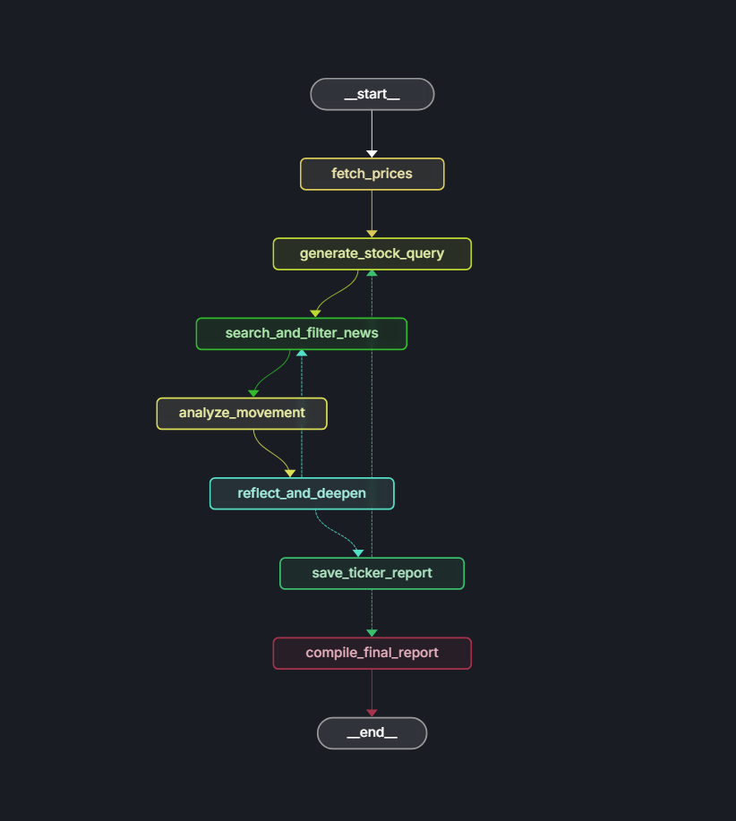

# Stock Movement Analyzer

Most stock analysis tools give you a single LLM-generated answer with no source accountability, no confidence calibration, and no way to tell whether the evidence behind an explanation is actually strong. The result is plausible-sounding narratives that may or may not reflect reality.

`stock-movement-analyzer` takes a different approach. It's a local-first agentic research engine that keeps searching until the evidence is strong enough, scores every source for credibility, isolates evidence across tickers to prevent contamination, and delivers investor-style briefings with transparent confidence ratings.

## Architecture



The system is built as a LangGraph state machine with six nodes:

1. **`fetch_prices`** -- gathers recent price action and sector context from Yahoo Finance for each ticker.
2. **`generate_stock_query`** -- prompts the model to produce a targeted, authoritative search query rather than a generic one.
3. **`search_and_filter_news`** -- pulls web results via Tavily, scores each source for credibility, and filters out low-quality evidence before it reaches the reasoning step.
4. **`analyze_movement`** -- synthesizes price data and filtered evidence into an explanation of the move.
5. **`reflect_and_deepen`** -- evaluates the current explanation, assigns a confidence score, and decides whether to loop back for another research pass or accept the result.
6. **`save_ticker_report`** / **`compile_final_report`** -- persists per-ticker briefings and assembles the final portfolio summary.

The diagram uses the shorter `search_news` label for the implemented `search_and_filter_news` step.

## Design Decisions

**Confidence-gated loops over fixed iteration.** Rather than running a predetermined number of research passes, the agent self-evaluates after each cycle. If the confidence score is below the threshold, it generates a new search query targeting the gaps in its current explanation and loops back. This means simple, well-covered moves resolve in one pass while ambiguous or multi-factor moves get deeper investigation automatically.

**Per-ticker state isolation.** Each ticker runs through the pipeline with its own scoped state. Sources, evidence, and partial explanations from one symbol never bleed into another ticker's report. The test suite includes a multi-ticker regression specifically validating this boundary, because source contamination across tickers would produce misleading analysis.

**Source credibility scoring.** Not all search results are equal. The system scores sources across tiers (primary, trusted, acceptable, junk) and filters before the LLM ever sees them. This prevents the model from building explanations on top of low-quality blog posts or SEO content when authoritative reporting exists.

**Local-first inference.** All LLM inference runs locally through Ollama or LMStudio. This is a deliberate choice for privacy (no portfolio data leaves the machine), cost control (no per-token API charges for iterative research loops), and no vendor lock-in. The architecture is model-agnostic; swapping to a hosted API would require changing only the provider config.

## Reliability and Testing

The agent is designed to fail gracefully rather than silently produce bad output:

- Confidence thresholds prevent the agent from reporting low-evidence explanations as definitive.
- Source isolation is enforced at the state level and validated by regression tests.
- The routing layer handles edge cases like empty search results or model refusals without crashing the pipeline.

The test suite covers credibility scoring logic, graph routing decisions, report formatting, and the multi-ticker source isolation boundary:

```bash
python -m unittest discover -s tests -v
```

Linting via Ruff:

```bash
ruff check .
```

## Example Output

The final report reads like a short investor briefing:

```md
### NVDA
*Moved UP 4.12% over 5 days ($104.23 -> $108.52)*

NVIDIA's move was primarily driven by...

**Confidence:** 87% (HIGH CONFIDENCE)

**Sources (credibility-scored):**
* [PRIMARY 95/100] ...
```

## Future Directions

- **Execution tracing and auditability.** Logging each node's inputs, outputs, and model parameters as a verifiable trace, so the full chain of reasoning behind a report can be independently audited and reproduced.
- **Deterministic inference.** Pinning model weights and sampling parameters to produce bit-exact reproducible outputs across runs, enabling third-party verification that a given report was generated from a specific model and evidence set.
- **Pluggable model backends.** Extending beyond local inference to support hosted APIs, enabling cost/quality trade-offs per use case while keeping the orchestration layer unchanged.
- **Real-time streaming.** Exposing the LangGraph pipeline as a streaming API so partial results surface as each ticker completes, rather than waiting for the full portfolio.

## Getting Started

**Requirements:** Python 3.10+, a [Tavily API key](https://tavily.com), and a local model served through [Ollama](https://ollama.ai) or [LMStudio](https://lmstudio.ai).

```bash
# Clone and install
git clone https://github.com/Bakr-963/stock_movement_analyzer_agent.git
cd stock_movement_analyzer_agent
python -m venv .venv && source .venv/bin/activate
pip install -e .

# Configure
cp .env.example .env
# Edit .env with your Tavily key and model settings

# Pull a model (example)
ollama pull gemma4:e4b-it-q8_0

# Run
stock-movement-analyzer NVDA AAPL TSLA
```

With custom parameters:

```bash
stock-movement-analyzer NVDA AAPL TSLA \
  --lookback-days 5 \
  --max-research-loops 3 \
  --confidence-threshold 80 \
  --output report.md
```

### Configuration Reference

| Variable | Description |
|---|---|
| `TAVILY_API_KEY` | Required. Web search API key. |
| `LLM_PROVIDER` | `ollama` or `lmstudio` |
| `LOCAL_LLM` | Model name (e.g., `gemma4:e4b-it-q8_0`) |
| `OLLAMA_BASE_URL` | Ollama server URL (default: `http://localhost:11434`) |
| `LMSTUDIO_BASE_URL` | LMStudio OpenAI-compatible URL |
| `MAX_RESEARCH_LOOPS` | Max research passes per ticker |
| `CONFIDENCE_THRESHOLD` | Minimum confidence to accept an explanation |

### LangGraph Studio

The project exports a compiled graph via `langgraph.json` for use with LangGraph Studio or API-based workflows:

```bash
pip install -e .
langgraph dev
```

### Docker

```bash
docker build -t stock-movement-analyzer .
docker run --rm \
  --env-file .env \
  -v "$(pwd):/workspace" \
  stock-movement-analyzer NVDA AAPL TSLA \
  --output /workspace/report.md
```

If your model server runs on the host, use `host.docker.internal` instead of `localhost` in your `.env`.

## Project Structure

```text
.
|-- assets/
|   `-- Agent_Architecture.png
|-- src/
|   |-- cli.py                      # CLI argument parsing
|   |-- config.py                   # settings and dependency builders
|   |-- credibility.py              # source scoring and filtering
|   |-- graph.py                    # LangGraph assembly
|   |-- market_data.py              # Yahoo Finance data collection
|   |-- nodes.py                    # graph node implementations
|   |-- prompts.py                  # LLM prompt templates
|   |-- routing.py                  # graph routing decisions
|   |-- search.py                   # Tavily search helpers
|   `-- state.py                    # shared graph state definitions
|-- tests/
|   |-- test_credibility.py         # credibility scoring tests
|   |-- test_graph.py               # graph smoke and regression tests
|   |-- test_reporting.py           # report formatting tests
|   `-- test_routing.py             # graph routing tests
|-- Dockerfile
|-- langgraph.json
`-- pyproject.toml
```
